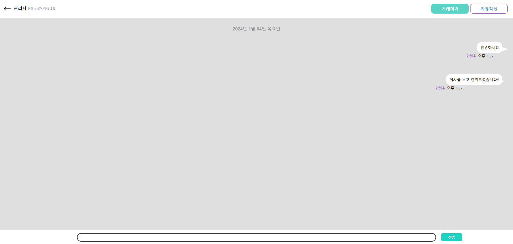

# Would, U?
> o2o비즈니스 서비스 - 품앗이

## 프로젝트 개요

- 개발 기간: 2023.11.20 ~ 2024.01.04
  
- 본 프로젝트의 간단한 설명
  - [노션 링크 - 품앗이](https://www.notion.so/Poom-At-Yee-finalProject-a631c6c9bdae4d0f992284a14257b097?pvs=4)

## 기술 스택
`Skill`


`Communication`


## 사용 라이브러리및 API
- 카카오페이 API
- nurigo2.0
- 카카오맵 API
- 네이버아이디로그인 API
- 한국산업인력공단 국가자격증 목록
- coolsms
- gmail API

## 실행 방법

사전작업 - sts3, jdk 1.8버전, 아파치톰캣8.5, Spring Legacy Project, 스프링 프레임워크 버전 5.3.14
```sh
pom.xml에 dependency 추가
<!-- 1. DB관련(오라클, 마이바티스등) 라이브러리 -->
		<!-- 1_1. ojdbc6 라이브러리 -->
		<dependency>
		    <groupId>com.oracle.database.jdbc</groupId>
		    <artifactId>ojdbc6</artifactId>
		    <version>11.2.0.4</version>
		</dependency>
		
		<!-- 1_2. 스프링에서 JDBC기능을 사용하기 위해서는 별도의 라이브러리가 필요 -->
		<dependency>
		    <groupId>org.springframework</groupId>
		    <artifactId>spring-jdbc</artifactId>
		    <version>${org.springframework-version}</version>
		</dependency>
		
		<!-- 1_3. 순수 myBatis라이브러리 -->
		<dependency>
		    <groupId>org.mybatis</groupId>
		    <artifactId>mybatis</artifactId>
		    <version>3.5.7</version>
		</dependency>
		
		<!-- 1_4. 스프링에서 myBatis를 사용하기위한 라이브러리 -->
		<dependency>
		    <groupId>org.mybatis</groupId>
		    <artifactId>mybatis-spring</artifactId>
		    <version>2.0.6</version>
		</dependency>
		
		<!-- 1_5. 커넥션풀을 사용하기위한 라이브러리 -->
		<dependency>
		    <groupId>commons-dbcp</groupId>
		    <artifactId>commons-dbcp</artifactId>
		    <version>1.4</version>
		</dependency>
		
		<!-- 2. Lombok 라이브러리 -->
		<dependency>
		    <groupId>org.projectlombok</groupId>
		    <artifactId>lombok</artifactId>
		    <version>1.18.24</version>
		    <scope>provided</scope>
		</dependency>
		
		<!-- 3. Spring Security Module(core, web, config) -->
		<dependency>
			<groupId>org.springframework.security</groupId>
			<artifactId>spring-security-core</artifactId>
			<version>5.5.2</version>
		</dependency>
		<dependency>
			<groupId>org.springframework.security</groupId>
			<artifactId>spring-security-web</artifactId>
			<version>5.5.2</version>
		</dependency>
		<dependency>
			<groupId>org.springframework.security</groupId>
			<artifactId>spring-security-config</artifactId>
			<version>5.5.2</version>
		</dependency>
		
		<!-- 4. 파일업로드를 위한 라이브러리 -->
		<dependency>
		    <groupId>commons-fileupload</groupId>
		    <artifactId>commons-fileupload</artifactId>
		    <version>1.5</version>
		</dependency>
		<dependency>
		    <groupId>commons-io</groupId>
		    <artifactId>commons-io</artifactId>
		    <version>2.11.0</version>
		</dependency>
		
		<!-- json관련 라이브러리 -->
		<!-- https://mvnrepository.com/artifact/com.google.code.gson/gson -->
		<dependency>
			<groupId>com.google.code.gson</groupId>
			<artifactId>gson</artifactId>
			<version>2.10.1</version>
		</dependency>
		
		<!-- https://mvnrepository.com/artifact/com.googlecode.json-simple/json-simple -->
		<dependency>
		    <groupId>com.googlecode.json-simple</groupId>
		    <artifactId>json-simple</artifactId>
		    <version>1.1.1</version>
		</dependency>
		<!-- 메일 전송 관련 라이브러리 -->      
		<dependency>
		    <groupId>org.springframework</groupId>
		    <artifactId>spring-context-support</artifactId>
		    <version>${org.springframework-version}</version>
		</dependency>
		
		<dependency>
		    <groupId>com.sun.mail</groupId>
		    <artifactId>javax.mail</artifactId>
		    <version>1.6.2</version>
		</dependency>
		
		<dependency>
		    <groupId>javax.mail</groupId>
		    <artifactId>javax.mail-api</artifactId>
		    <version>1.6.2</version>
		</dependency>
		
		<!-- https://mvnrepository.com/artifact/org.springframework/spring-websocket -->
		<dependency>
		    <groupId>org.springframework</groupId>
		    <artifactId>spring-websocket</artifactId>
		    <version>${org.springframework-version}</version>
		</dependency>
		
		<!-- sms문자인증 관련 라이브러리 -->
		 <dependency>
		    <groupId>net.nurigo</groupId>
		    <artifactId>javaSDK</artifactId>
		    <version>2.2</version>
		</dependency>
```

1. 사전 작업 후 해당 레파지토리를 클론받기

```sh
$ git clone https://github.com/GIYUN9/FinalProject.git
```

2. 클론 받은 파일중 sql파일을 오라클 sqldeveloper로 아이디 final 비밀번호 final로 계정을 생성하고 리소스와 커넥션 권한을 주고 스크립트 실행

3. 톰캣 버전 8.5로 서버에 추가한뒤 해당 프로젝트를 실행해줍니다

## 주요 기능

### ✏ 로그인, 게시글작성, 포인트 충전, 채팅, 상품구매(요청) 
  
  
  

+ 로그인
  + 회원 가입 (이메일 인증, 전화번호 인증)
  + 아이디 및 비밀번호 찾기(및 변경)
  + 네이버 아이디로 로그인(회원가입)

+ 마이페이지
  + 회원정보 수정, 비밀번호 변경, 회원탈퇴
  + 전문가 정보 수정 (국가자격증 선택)
  + 요청관리 및 문의 내역 조회, 작성
  + 카카오페이를 통한 포인트 충전
  + 카카오지도API를 통한 도로명 주소 등록
  + -관리자 페이지 : 회원관리(강제탈퇴) 및 신고 내역 열람

+ 검색
  + 공지사항 배너
  + 각 게시판 조회수 순 2개 키워드 검색

### ⚙ 주 게시판 및 커뮤니티 게시판, 채팅
  
  
  
  

+ 주게시판(도와줄게요, 도와주세요)
  + CRUD기능 및 1장이상의 파일 업로드 기능
  + 관련 게시글 서비스 구매(요청)

+ 커뮤니티
  + 게시판 CRUD, 카테고리별 조회
  + 공지사항 추가, 삭제, 조회(열람)
  + 게시판 댓글 및 좋아요

+ 채팅
  + 1대1 채팅 기능(소켓사용)
  + 입력한 채팅 내용 저장

## 팀원 소개

| 이름 | 포지션 | Contact |
| --- | --- | --- |
| 나기윤 | 조장 |[github.com/GIYUN9](https://github.com/GIYUN9) |
| 최창영 | 형상관리 | [github.com/Choechang](https://github.com/Choechang) |
| 김경보 | DB관리 | [github.com/havitaz](https://github.com/havitaz) |
| 이지혜 | 이슈관리 | [github.com/heu0808](https://github.com/heu0808) |
